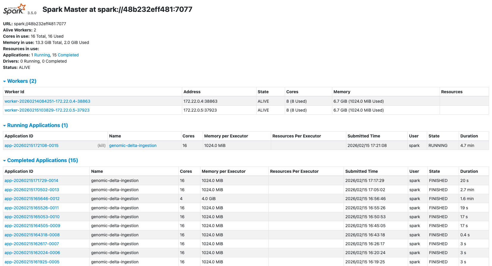
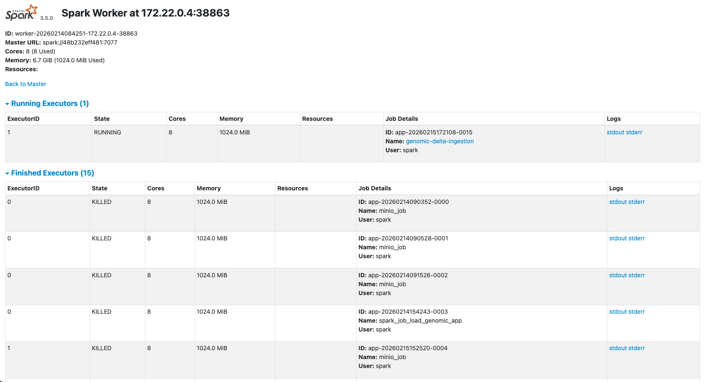
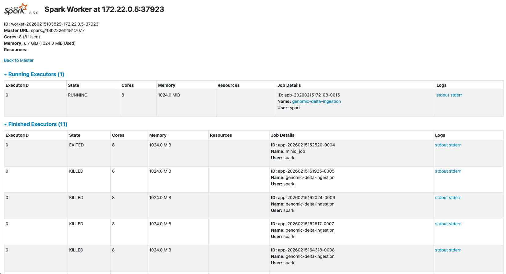

# Description
In this repo we will create a Spark Docker Cluster integrated with Minio and Spark Table. To check the capacity of the cluster we will ingest a big csv file representing a genomic expression of several patients. Also we present Spark connect and some samples deployes on docker too.

## Infrastructure 
We need only Minio as persistence service. 

- First create a virtual network where all services will be deployed:

  ```
  $ docker network create spark-net
  ```

- Deploy Minio:

  In docker 20.10.5 (Ubuntu 20.04), we must use a older minio version to start:

  ```
  $ docker run -d \
      --name spark-minio \
      --network spark-net \
      -p 9000:9000 \
      -p 9001:9001 \
      -e MINIO_ROOT_USER=admin \
      -e MINIO_ROOT_PASSWORD=password \
      -v minio-data:/data \
      minio/minio:RELEASE.2025-01-20T14-49-07Z \
        server --console-address ":9001" /data 
  ```
    
    In docker 28.1.1 (Ubuntu 24.04)
    ```
    $ docker run -d \
        --name spark-minio \
        --network spark-net \
        -p 9000:9000 \
        -p 9001:9001 \
        -e MINIO_ROOT_USER=admin \
        -e MINIO_ROOT_PASSWORD=password \
        -v minio-data:/data \
        minio/minio:latest \
          server --console-address ":9001" /data 
    ```

- Create a bucket called in my case `genomic`. Spark Delta Lake create the table, but not the bucket, you must create manually from Minio UI or from Python (In this case you can use mc minio CLI or from Python using minio SDK).

## Spark Cluster

- We will use the Spark 3.5.0 using the [Spark Docker Image](https://hub.docker.com/_/spark): `spark:3.5.0-python3`

- The spark master delegate the job created to spark workers so we don't need any special image only execute this command using the default spark image:

  ```
  $ docker run -d \
      --name spark-master \
      --network spark-net \
      -p 7077:7077 \
      -p 8080:8080 \
      spark:3.5.0-python3 \
        bash -c "
          /opt/spark/sbin/start-master.sh && \
          tail -f /opt/spark/logs/*
        "
  ```

- To execute our jobs we need integrate delta spark and minio S3 to connect to Minio and create the delta tables inside it. So irst we will create the custom spark worker docker image from worker Dockerfile


  ```
  $ docker build -t spark-worker:3.5.0-python3 .
  ```

- Now deploy two workers from this image:

  ```
    $ docker run -d \
        --name spark-worker-01 \
        -p 8081:8081 \
        -v $PWD/spark-defaults.conf:/opt/spark/conf/spark-defaults.conf \
        --network spark-net \
        spark-worker:3.5.0-python3 \
          bash -c "
            /opt/spark/sbin/start-worker.sh \
            spark://spark-master:7077 && \
            tail -f /opt/spark/logs/*
          "
    ```

    ```
    $ docker run -d \
        --name spark-worker-02 \
        -p 8082:8081 \
        -v $PWD/spark-defaults.conf:/opt/spark/conf/spark-defaults.conf \
        --network spark-net \
        spark-worker:3.5.0-python3 \
          bash -c "
            /opt/spark/sbin/start-worker.sh \
            spark://spark-master:7077 && \
            tail -f /opt/spark/logs/*
          "
    ```

## Execute Transformation Pipeline
Before ingest the dataset we must first prepate the dataset to be ingest in the second pipeline. In this pipeline we only load the hdf dataset from local and transform in a parquet format and ingest this unique file in a Minio Bucket called genomic-shared. We onlu execute the python script called **hdf_to_parquet.py**

## Execute Ingestion Pipeline

With the dataset ppretreated and ingest in Minio, we will try to ingest our genomic dataset as delta table. This dataset it's about 8882 rows (patients) with 19992 columns (gens) + 3 columns (metadata). We must transform the structure of this dataset from (8882,19992+3) to (170917803, 5) shape, to acelerate later analysis.

The original structure dataset (8882,19996) is like this. Where the fhe first 19992 columns represente the genomix expression of each patient, and the last three columns the metadata: unique identifier attached to each patient, the cancer type and tumor name related to this genomic expressions

```
gene-1 | gene-2 | ... | gene-19992 | submitter_id | cancer | tumor 
```

The new structure dataset (170917803,5) will be transformed like this. Where will be more easy make queries related to any patient attached to cancer, tumor or gene expression:

```
sample_id | cancer | tumor | gene | expression
```

This transformation will be executed in parallel by all spark workers in batches before ingest the result in the minio delta table. This parallel process of transformation and ingestion accelerate the execution of the pipeline considerably. Using two nodes we can ingest 170917803 rows in 7.2 minutes in my Mac M1 laptop in a minio delta table called genomic/gene-expression

To execute the ingestion deploy the submitter docker container with the spark app as argument, like his:

```
$ docker run -it \
  --name job-genomic-ingestion \
  --rm \
  -v $PWD/src/genomic-job-save-s3-to-delta.py:/jobs/genomic-job-save-s3-to-delta.py \
  --network spark-net \
  spark-submit:3.5.0-python3 \
    /opt/spark/bin/spark-submit \
    --master spark://spark-master:7077 \
    /jobs/genomic-job-save-s3-to-delta.py
```

You can check the UIs of Minio and Spark:


Minio UI
```
http://localhost:9001/browser/genomic/gene-expression
```


Spark Master UI
```
http://localhost:8080/
```



Spark Worker 01 UI
```
http://localhost:8081/
```



Spark Worker 02 UI
```
http://localhost:8082/
```



## Load Data
After ingest the dataset into a delta table we can analyze and make some sql queries:

```
docker run -it \
  --name job-genomic-load \
  --rm \
  -v $PWD/src/genomic-job-load-delta-to-pandas.py:/jobs/genomic-job-load-delta-to-pandas.py \
  --network spark-net \
  spark-submit:3.5.0-python3 \
    /opt/spark/bin/spark-submit \
    --master spark://spark-master:7077 \
    /jobs/genomic-job-load-delta-to-pandas.py
```

## Spark connect
Also we have some sample of using Spark connect. For it we create a master connect docker image with Spark Connect and S3 integration for it:

```
$ docker build -t spark-connect:3.5.0-python3 .
```

We must start spark master and spark connect at the same time. In this case the cluster will be not used. The query will be executed in the spark-connect container without any distribution as before.

```
$ docker run -d \
  --name spark-connect \
  --network spark-net \
  -p 7077:7077 \
  -p 8080:8080 \
  -p 15002:15002 \
  -v $PWD/spark-defaults.conf:/opt/spark/conf/spark-defaults.conf \
  spark-master:3.5.0-python3 \
    bash -c "
      /opt/spark/sbin/start-master.sh && \
      /opt/spark/sbin/start-connect-server.sh && \
      tail -f /opt/spark/logs/*
    "
```

## Notes
Actually exist a `spark-client` [python package](https://pypi.org/project/pyspark-client/) implement only Spark Connect, but the minimum version is 4.0.0. Unistalling pyspark 3.5.0 and use this light version could works. But you must refactor the Dockerfile to get the compatible jar files with this new Spark Connect 4.0.0 version.

## Links 
- [Spark Docker Hub](https://hub.docker.com/_/spark)
- [spark Session Configuration ](https://spark.apache.org/docs/latest/configuration.html)