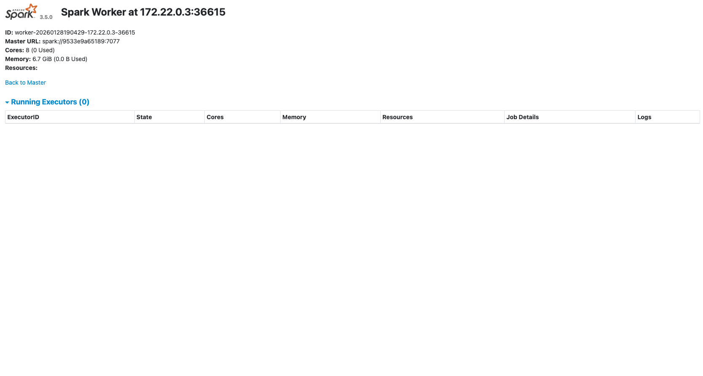

# Description
Integrate Minio with Spark Delta Lake and Spark Connect. Test with a Spark Driver

## Python Spark Master and Worker dependencies
We will use the Spark 3.5.0 using the [Spark Docker Image](https://hub.docker.com/_/spark): `spark:3.5.0-python3`

## Python Spark Client dependencies
We must install pyspark 3.5.0 aligned with Spark Docker Image 3.5.0 including these dependencies:

```
pip install pyspark==3.5.0
pip install pandas
pip install pyarrow
pip install googleapis-common-protos
pip install grpcio 
pip install grpcio-tools
pip install grpcio-status
pip install protobuf
```

The dependencies Google gRPC because the protocol used by the Sparck Clients and the Spark Master is using gRPC 
```
googleapis-common-protos
grpcio
grpcio-tools
grpcio-status
protobuf
```

The dependency `pyarrow` because the response from Spark Master is using gRPC throw pyarrow to acelerate this response

And finally `pandas` to convert Spark Dataframe response to Pandas structures to be easy read

## Steps

You must start these services

Start Minio Service
```
$ docker run -d \
  --name spark-minio \
  --network spark-net \
  -p 9000:9000 \
  -p 9001:9001 \
  -e MINIO_ROOT_USER=admin \
  -e MINIO_ROOT_PASSWORD=password \
  -v minio-data:/data \
  minio/minio:latest \
  server /data --console-address ":9001"
```

Start Spark Master Service
```
$ docker run -d \
  --name spark-master \
  --network spark-net \
  -p 7077:7077 \
  -p 8080:8080 \
  -p 15002:15002 \
  -v $PWD/spark-defaults.conf:/opt/spark/conf/spark-defaults.conf \
  spark:3.5.0-python3-connect \
  bash -c "
    /opt/spark/sbin/start-master.sh && \
    /opt/spark/sbin/start-connect-server.sh && \
    tail -f /opt/spark/logs/*
  "
```

Start Spark Worker Service
```
$ docker run -d \
    --name spark-worker \
    --network spark-net \
    -p 8081:8081 \
    -v $PWD/spark-defaults.conf:/opt/spark/conf/spark-defaults.conf \
    spark:3.5.0-python3 \
    bash -c "
      /opt/spark/sbin/start-worker.sh \
      spark://spark-master:7077 && \
      tail -f /opt/spark/logs/*
    "
```

You can check the UIs of Minio and Spark:


Minio UI
```
http://localhost:9001/browser/delta-bucket
```


Spark Master UI
```
http://localhost:8080/
```


Spark Worker UI
```
http://localhost:8081/
```



## Notes
Actually exist a `spark-client` [python package](https://pypi.org/project/pyspark-client/) implement only Spark Connect. Maybe unistalling pyspark and use this light version could works too using Spark Connect clients delegating all work to Spark Master.

## Links 
- [Spark Docker Hub](https://hub.docker.com/_/spark)
- [spark Session Configuration ](https://spark.apache.org/docs/latest/configuration.html)